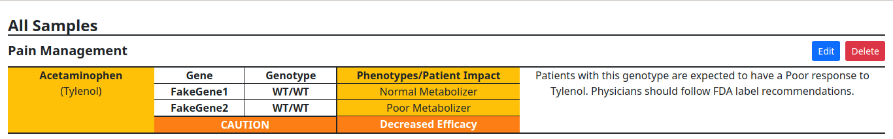

# Pharma Test Project

Sample test project to upload fake JSON data to a SQlite database to display a list of fake pharmaceutical samples information. Built with Django, Jsonschema, Webpack, jQuery and Bootstrap.

# Screenshot



# Getting Started

First clone the repository from Github and switch to the new directory:

    $ git clone git@github.com/kuipumu/pharma_test_project.git
    $ cd pharma_test_project
    

Create and activate the virtualenv for your project.

    $ virtualenv venv
    $ source venv/bin/activate
    

Install project dependencies:

    $ pip install -r requirements/local.txt
    
    
Then simply apply the migrations:

    $ python manage.py migrate
    

You can now run the development server:

    $ python manage.py runserver

# How to use it?

- Go to the address http://127.0.0.1:8000/ on your web browser and go click on the "Add" button.
- Now you can add fake pharmaceutical sample data by writing the JSON code on the JSON editor. The JSON schema is validated in order to maintain integrity, here is a sample of the JSON data.

```
{
    "SampleNumber":"12345",
    "PipelineVersion":"0.0.1",
    "Sequencer":"iontorrent",
    "KnowledgebaseVersion":"0.0.1",
    "DateGenerated":"06/11/2021 2:30PM EST",
    "CurrentMedications":[
        {
            "Drugs":[
                {
                    "Generic":["Acetaminophen"], 
                    "Trade":["Tylenol"]
                }
            ],
            "TheraputicArea":["Pain Management"],
            "GeneInfo":[
                {
                    "Gene":"FakeGene1",
                    "Genotype":"WT/WT",
                    "Phenotype":"Normal Metabolizer"
                },
                {
                    "Gene":"FakeGene2",
                    "Genotype":"WT/WT",
                    "Phenotype":"Poor Metabolizer"
                }
            ],
            "GroupPhenotype":"Decreased Efficacy",
            "Action":["CAUTION"],
            "Recommendation":"Patients with this genotype are expected to have a Poor response to Tylenol. Physicians should follow FDA label recommendations."
        }
    ]
}
```

- Click on "Save" and then click on "Return".
- Now you will see the JSON data you just uploaded on a list.